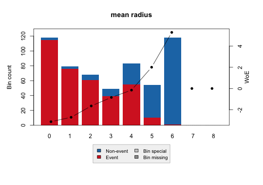
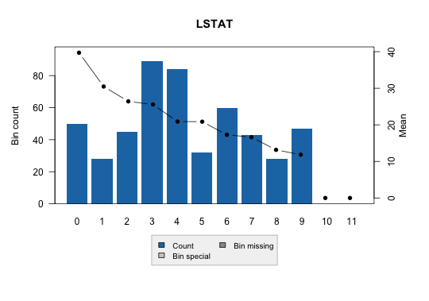
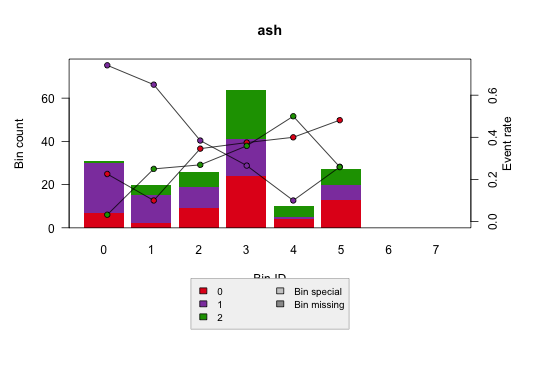

# optbinningR

[](https://github.com/s-rani1/optbinningR/actions/workflows/R-CMD-check.yaml)

`optbinningR` is a native R package for optimal binning, scorecard, and monitoring workflows.

This is an independent implementation for the R community, inspired by the Python package `optbinning`, but rewritten for R users and R package conventions.

## Relationship to Python `optbinning`

- Upstream project (reference): [optbinning GitHub](https://github.com/guillermo-navas-palencia/optbinning)
- Upstream docs/tutorials: [optbinning documentation](https://gnpalencia.org/optbinning/)

`optbinningR` references the upstream methodology and tutorials, but the package code here is reimplemented in R for direct R usage.

## Install

CRAN (after acceptance):

```r
install.packages("optbinningR")
```

GitHub:

```r
remotes::install_github("s-rani1/optbinningR")
```

Local tarball:

```r
install.packages("optbinningR_0.2.0.tar.gz", repos = NULL, type = "source")
```

## No Python dependency for normal use

Core package usage is native R.

You do **not** need Python for:
- binary / multiclass / continuous optimal binning
- binning tables and plots
- `BinningProcess`, `Scorecard`, monitoring, counterfactuals
- 2D / piecewise / sketch / uncertainty APIs

Python parity scripts in `scripts/` are optional validation utilities only.

## Quick start (binary)

```r
library(optbinningR)

d <- read.csv(system.file("extdata", "breast_cancer_mean_radius.csv", package = "optbinningR"))
y <- d$y
x <- d$x

ob <- OptimalBinning(name = "mean radius", dtype = "numerical")
ob <- fit(
  ob, x, y,
  algorithm = "optimal",
  prebinning_method = "cart",
  max_n_prebins = 20,
  max_n_bins = 6,
  monotonic_trend = "auto"
)

bt <- binning_table(ob)
build(bt)
plot(ob, type = "woe")
```

## Plot previews

Binary:



Continuous:



Multiclass:



## Tutorials included in this repo

These are GitHub-rendered tutorial pages (recommended for reading):

- Binary tutorial: [`docs/tutorials/binary.md`](docs/tutorials/binary.md)
- Continuous tutorial: [`docs/tutorials/continuous.md`](docs/tutorials/continuous.md)
- Multiclass tutorial: [`docs/tutorials/multiclass.md`](docs/tutorials/multiclass.md)

Source R Markdown files (for editing/running):

- Binary source: [`inst/doc/tutorial-binary.Rmd`](inst/doc/tutorial-binary.Rmd)
- Continuous source: [`inst/doc/tutorial-continuous.Rmd`](inst/doc/tutorial-continuous.Rmd)
- Multiclass source: [`inst/doc/tutorial-multiclass.Rmd`](inst/doc/tutorial-multiclass.Rmd)
- Getting started source: [`inst/doc/getting-started.Rmd`](inst/doc/getting-started.Rmd)

## Current scope

- Native R optimal binning: binary, multiclass, continuous targets
- Numerical and categorical variables
- Monotonic constraints: `ascending`, `descending`, `peak`, `valley`, `auto`
- Python-style `binning_table` handle and `build()` output format
- Plot parity work aligned to official tutorial styles
- `BinningProcess` and `Scorecard` workflows
- `scorecard_monitoring()` and `counterfactual_scorecard()`
- Tutorial workflow helpers: `run_fico_tutorial()` and `run_telco_tutorial()`

## CRAN and release notes

See [`CRAN_RELEASE_CHECKLIST.md`](CRAN_RELEASE_CHECKLIST.md).

## Citation and attribution

If this package helps your work, please cite this repository and also cite the original Python `optbinning` project and references listed in its documentation.
