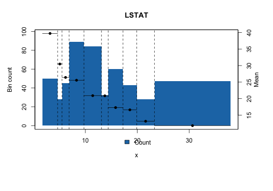

# Continuous Tutorial (Rendered)

This is the GitHub-rendered version of the continuous tutorial.

Source R Markdown: [`inst/doc/tutorial-continuous.Rmd`](../../inst/doc/tutorial-continuous.Rmd)

## Example plots

Default style:


Actual-width style:



## Core flow

```r
library(optbinningR)
data("Boston", package = "MASS")

optb <- fit(
  ContinuousOptimalBinning("LSTAT"),
  x = Boston$lstat,
  y = Boston$medv,
  algorithm = "optimal",
  prebinning_method = "cart",
  max_n_prebins = 20,
  max_n_bins = 10,
  monotonic_trend = "auto"
)

bt <- build(binning_table(optb))
plot(optb, metric = "mean", style = "bin")
plot(optb, metric = "mean", style = "actual")
plot(optb, metric = "mean", style = "bin", show_bin_labels = TRUE)
```
